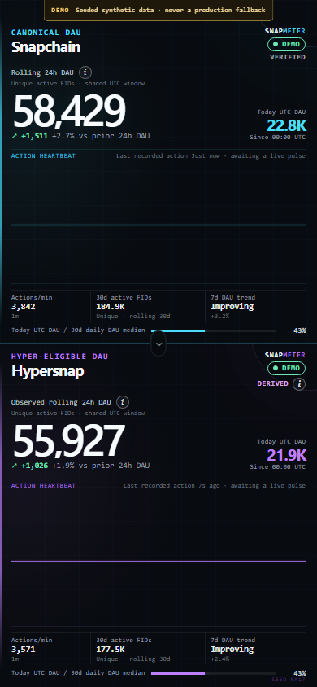

# SnapMeter

**Live activity across Snapchain and Hypersnap.** SnapMeter is a mobile-first, real-time analytics dashboard for active Farcaster FIDs. It pairs a Windows-friendly collector with exact rolling metrics, a durable Cloudflare ingestion path, and a data-driven heartbeat that pulses only for newly observed qualifying activity.

## Live Dashboard

[Open SnapMeter](https://snapmeter.ael-dev3.workers.dev)

The public origin, API, authenticated ingest, D1 persistence, WebSocket hydration, real pulse fan-out, and duplicate suppression were smoke-tested after deployment. Source availability changes independently of the website, so the dashboard always renders the latest authenticated health state instead of promising that either upstream node is live. Use `?demo=1` only for the clearly labelled seeded preview.

## Source quality

- **Snapchain** uses successful canonical `MERGE_MESSAGE` HubEvents, so its evidence mode is `verified`; a separate status becomes stale, degraded, partial, or disconnected when coverage, freshness, or reconciliation is unhealthy.
- **Hypersnap** is currently reported as **Hypersnap observed active FIDs** with a visible `DERIVED` state. The value is inferred from successful canonical merges seen through the configured Hypersnap node whose message types are eligible for its Hyper shadow stores. Upstream exposes no per-write Hyper success stream, so SnapMeter does not claim those shadow writes were independently verified.
- **Hypersnap endpoint failover** keeps one canonical source active at a time: the preferred local gRPC node first, then an identity-pinned HTTPS canonical-event replica if local is unavailable, and back to local only after repeated healthy probes and cursor/fingerprint continuity checks. A fallback does not make the metric verified or complete.
- **Unavailable, stale, degraded, and partial** states stay visible. Loading the website does not make a source live.

See [Data sources](docs/data-sources.md), [upstream pins](docs/upstream-sources.md), and the [complete metric policy](docs/metrics.md).

## Screenshot



Validated at **390 × 844** from the production bundle in deterministic demo mode. The `DEMO` labels distinguish these seeded synthetic values from live collector data.

## Metrics at a glance

| Metric | Exact definition |
|---|---|
| Rolling 24h active | Unique valid FIDs with a qualifying action in `(now - 24h, now]`. |
| Previous 24h active | Unique valid FIDs in `(now - 48h, now - 24h]`. |
| Today UTC DAU | Unique valid FIDs since `00:00:00 UTC` today. |
| 30d active | Unique valid FIDs in `(now - 30d, now]`; this is not called “30d DAU.” |
| Daily DAU | One unique-FID count for each of the latest 30 UTC calendar days. |

Action time comes from confirmed shard-chunk time when available. Collector receipt time is stored separately. Historical replay updates metrics silently and never creates a fake live pulse.

## Quick start

A clean checkout can reproduce the dashboard, deterministic demo, tests, and production bundle without credentials, a database dump, or a node snapshot. Requirements are Git, Node.js 24 or later, and pnpm 11.19.0.

```powershell
git clone https://github.com/ael-dev3/SnapMeter.git
Set-Location SnapMeter
pnpm install --frozen-lockfile
pnpm dev
```

Open the URL printed by Vite with `?demo=1`, normally `http://127.0.0.1:5173/?demo=1`. Demo mode is deterministic, synthetic, clearly labelled, and does not contact a collector or require private data.

To connect the collector, copy the environment template only after the demo works and keep the resulting file untracked. The template prefers private local gRPC endpoints and includes an identity-pinned public Hypersnap HTTPS fallback:

```powershell
Copy-Item .env.example .env
./scripts/bootstrap.ps1
./scripts/run-collector.ps1 -EnvFile .env -Mode doctor
./scripts/run-collector.ps1 -EnvFile .env -Mode run
```

The convenience endpoint defaults are `127.0.0.1:3383` for Snapchain and `127.0.0.1:4383` for the preferred local Hypersnap node. Upstream Hypersnap also listens on internal port `3383`; `4383` is only the documented host remap when both nodes share one machine. The checked-in fallback points to the public node currently listed by the [official Hypersnap portal](https://hypersnap.org/). That listing proves neither node age nor historical uptime, and the exact peer/version pins deliberately fail closed when the operator changes the endpoint.

The complete clean-room procedure, including local D1 migration, optional upstream-node checkouts, storage layout, validation, and the boundary around intentionally excluded private data, is in [Local reconstruction](docs/local-reconstruction.md).

## Architecture

```text
Snapchain HubService -------------------+
                                        +--> Windows collector --> SQLite + durable outbox
Hypersnap local gRPC (preferred) -------+                              |
Hypersnap HTTPS events (fallback only) -+                              | signed batches
                                                                       v
React/Vite assets <-- Cloudflare Worker API <-- D1 + hibernating Durable Object
        ^                                               |
        +---------------- WebSocket live fan-out --------+
```

The collector discovers positive data-shard IDs through `GetInfo`, maintains one durable cursor and one reconciliation state machine per source/shard, treats `GetEvents` as durable authority, and uses `Subscribe` for low latency. The browser never receives an ingest secret or direct node credentials. More detail is in [Architecture](docs/architecture.md).

## Collector setup

Edit `.env` before a production run. Keep both node RPC listeners private and provide the Cloudflare ingest URL and secret:

```dotenv
SNAPCHAIN_GRPC_URL=127.0.0.1:3383
HYPERSNAP_GRPC_URL=127.0.0.1:4383
SNAPCHAIN_GRPC_TLS=false
HYPERSNAP_GRPC_TLS=false
HYPERSNAP_EXPECTED_PEER_ID=
HYPERSNAP_EXPECTED_VERSION=
HYPERSNAP_RPC_TIMEOUT_MS=5000
HYPERSNAP_FALLBACK_HTTP_URL=https://haatz.quilibrium.com
HYPERSNAP_FALLBACK_EXPECTED_PEER_ID=12D3KooWMYfkXiNcn9LifPkLYiHtGmXYnknYG1yFBD53rUseUMUc
HYPERSNAP_FALLBACK_EXPECTED_VERSION=0.13.3
HYPERSNAP_FAILOVER_AFTER_FAILURES=3
HYPERSNAP_PREFERRED_RECOVERY_INTERVAL_MS=60000
HYPERSNAP_PREFERRED_RECOVERY_SUCCESSES=3
HYPERSNAP_MAX_BLOCK_DELAY_SECONDS=30
SNAPCHAIN_GRPC_API_KEY=
SNAPCHAIN_RPC_MIN_INTERVAL_MS=0
SNAPMETER_INGEST_URL=
SNAPMETER_INGEST_SECRET=
SNAPMETER_DATA_DIR=C:\ProgramData\SnapMeter
```

After deployment, set `SNAPMETER_INGEST_URL` to the smoke-tested origin plus `/api/v1/ingest/batch` and set the secret locally to the value stored with Wrangler. Never commit either value.

For a hosted Neynar Snapchain source, use `SNAPCHAIN_GRPC_URL=snapchain-grpc-api.neynar.com:443`, enable `SNAPCHAIN_GRPC_TLS=true`, place the Neynar credential in `SNAPCHAIN_GRPC_API_KEY`, and set `SNAPCHAIN_RPC_MIN_INTERVAL_MS=250` to pace shared two-shard replay below the Starter-plan request ceiling. Set `HYPERSNAP_SOURCE_MODE=unavailable` when neither a local node nor an accepted HTTPS fallback is connected. Keep the API key only in the ignored local environment file.

The public Hypersnap fallback exposes canonical HubEvents over HTTPS and is still `derived`; it does not expose an independently verified Hyper-write stream. A live retention probe during implementation reached only about three days, so it cannot supply an exact 30-day cold start. Keep the dashboard partial until prospective coverage reaches the full window. See [Data sources](docs/data-sources.md) for the trust, enrollment, and switching rules.

```powershell
./scripts/run-collector.ps1 -EnvFile .env -Mode doctor    # endpoints, shards, storage, clock, ingest auth, cursors, disk
./scripts/run-collector.ps1 -EnvFile .env -Mode run       # continuous collection
./scripts/run-collector.ps1 -EnvFile .env -Mode status    # last local health snapshot
./scripts/run-collector.ps1 -EnvFile .env -Mode backfill  # bounded reconciliation; never creates live pulses
```

Snapchain's default HubEvent retention is only three days. An exact 30-day cold start requires a node configured with at least 31 days of event retention or a trusted prior history. Otherwise SnapMeter exposes partial history until enough prospective data accumulates.

### Optional Docker collector

The default Compose profile runs only the collector and exposes no inbound port:

```powershell
docker compose --profile collector up -d
docker compose --profile collector logs -f collector
```

It expects `.env` and reaches Windows-hosted nodes through `host.docker.internal`. Override `SNAPCHAIN_GRPC_URL_DOCKER` or `HYPERSNAP_GRPC_URL_DOCKER` when needed. `docker-compose.nodes.override.yml` is a Compose 2.24.4+ illustrative fragment to merge into a separately reviewed upstream-node project; it replaces inherited port lists and maps host `3383` and `4383` to the two containers' internal `3383`. It deliberately cannot launch heavyweight nodes by itself.

## Windows startup

```powershell
./scripts/install-collector-task.ps1 -EnvFile .env
Get-ScheduledTask -TaskName SnapMeterCollector
./scripts/check-health.ps1 -EnvFile .env
./scripts/uninstall-collector-task.ps1
```

The default task starts at user logon and restarts after failure. Run the installer elevated with `-AtBoot` only when a boot-time `SYSTEM` task is appropriate. The installer validates configuration, creates data/log directories, and never prints secret values. See the [Windows runbook](docs/windows-runbook.md) for permissions, WSL2, firewall, storage, and recovery guidance.

## Cloudflare deployment

The production target is a single Cloudflare Worker named `snapmeter`, with D1 database `snapmeter-prod` bound as `DB`, Durable Object binding `LIVE_ROOM`, and secret `SNAPMETER_INGEST_SECRET`.

```powershell
pnpm install --frozen-lockfile
pnpm --filter @snapmeter/dashboard exec wrangler login
pnpm --filter @snapmeter/dashboard exec wrangler d1 migrations apply snapmeter-prod --remote
pnpm --filter @snapmeter/dashboard exec wrangler secret put SNAPMETER_INGEST_SECRET
pnpm --filter @snapmeter/dashboard run deploy
```

Do not publish a URL until all release smoke tests pass. Full creation, migration, secret, deployment, rollback, and GitHub Actions instructions are in [Deployment](docs/deployment.md).

## Validation

```powershell
pnpm lint
pnpm typecheck
pnpm security:check
pnpm test
pnpm build
pnpm test:e2e
```

Pull requests run the quality gates. Default-branch deployment is conditional on the required Cloudflare repository secrets. Operational and security checks are documented in [Troubleshooting](docs/troubleshooting.md) and [Security](docs/security.md).

## License

SnapMeter-authored source, documentation, and assets are released under the [MIT License](LICENSE), copyright 2026 ael-dev3. Vendored and adapted Snapchain protocol definitions retain upstream `GPL-3.0-only` terms, while the identified Warpkeep-derived Mini App portions retain Apache-2.0 notices. See [Third-party notices](THIRD_PARTY_NOTICES.md) and the complete texts in [`LICENSES/`](LICENSES/). Dependency packages retain their own licenses. No license grants rights to third-party names or trademarks.

## Documentation

- [Local reconstruction without private data](docs/local-reconstruction.md)
- [Architecture](docs/architecture.md)
- [Metric definitions and integrity policy](docs/metrics.md)
- [Data sources and source modes](docs/data-sources.md)
- [Pinned upstream sources](docs/upstream-sources.md)
- [Windows runbook](docs/windows-runbook.md)
- [Cloudflare deployment](docs/deployment.md)
- [Farcaster Mini App release](docs/farcaster-miniapp.md)
- [Security model](docs/security.md)
- [Private vulnerability reporting](SECURITY.md)
- [Troubleshooting](docs/troubleshooting.md)
